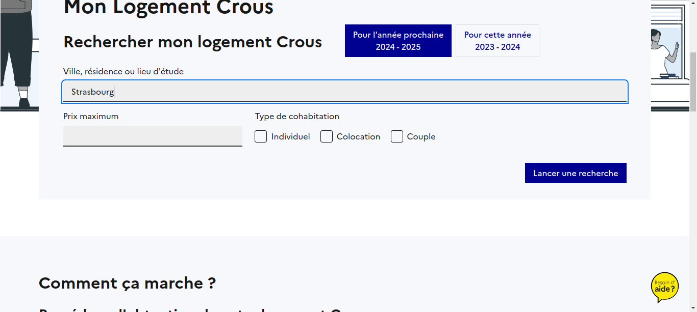
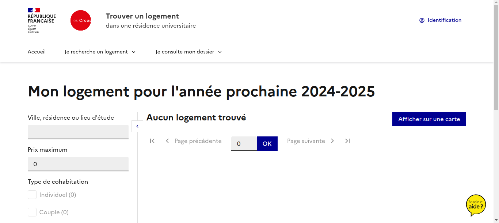
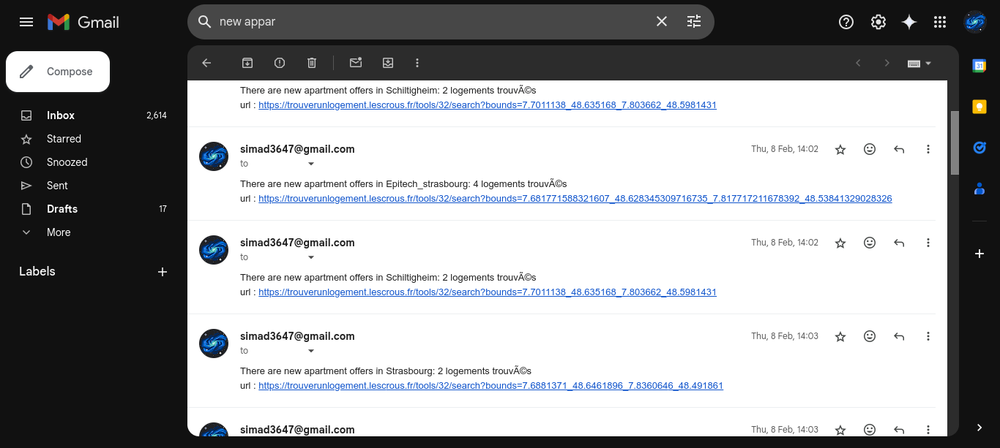

# CrousBot

CrousBot is a bot that helps people get notified if new apartments are being added in [trouverunlogement](https://trouverunlogement.lescrous.fr/). This bot helps people quickly get a notification to reserve an apartment. This ensures that users can act quickly to secure an apartment.

## Installation

1. Clone the repository:
```bash
git clone https://github.com/ImadSaddik/CrousBot.git
cd CrousBot
```

2. Install the required libraries:
```bash
pip install -r requirements.txt
```

## Usage

To use this bot follow these steps:
1. Create a `.env` file in the same directory and fill these values

```bash
RECEIVER_EMAIL="receiver_email"
SENDER_EMAIL="sender_email"
SENDER_PASSWORD="smtp_password"
```

The receiver and sender emails are straightforward to set, but for the password, watch this [video](https://www.youtube.com/watch?v=SalrBanIUmc) to find where to get it from.

2. Visit the [trouverunlogement](https://trouverunlogement.lescrous.fr/) website, type in the city and click on the search button.



- Copy the url of this page



- Put that url in a variable, you can also track more cities by adding more variables like this:
```python
url_1 = "paste_url"
url_2 = "paste_url"
...
```

- Change the locations dictionary accordingly, each url should have a name:

```python
locations = {
    "Strasbourg": url_1,
    "Lingolsheim": url_2,
    ...
}
```

3. Run the bot, if you want to decrease the delay, then change it from 60 seconds to a lower value.

```python
logger.info("Starting the scraper")
while True:
    for location, url in locations.items():
        check_for_new_offers(location, url)

    time.sleep(60)
```

## Results

The script will log any offer that it finds in a log file inside the `logs` directory. If the specified information in the `.env` file is correct, then the bot will send you an email to let you know that you should take action as quickly as possible.

Here is how the mail looks like:



## Contributing

Contributions are welcome! Please fork the repository and submit a pull request.

## Contact Information

For support or questions, please contact me at simad3647@gmail.com
